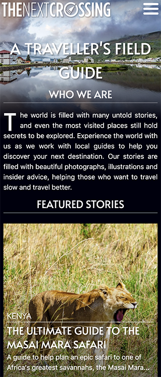
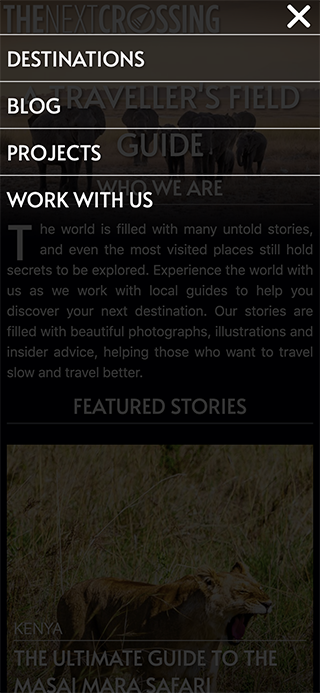

# Traveller's Field Guide Theme

Traveller's Field Guide is a blazing fast theme for travel photography bloggers. It's designed to bring the photographs to the fore of the reader experience. Instead of the usual trailing dropdown, it features a 2 level mega-menu organised by continent then country. The theme's main feature is that it is optimised for speed and SEO.

# Practical Implementation

This custom theme was developed for [The Next Crossing](www.thenextcrossing.com) website. The Next Crossing had been using an off the shelf template for many years and there were two pain points. 1) The theme did not showcase the photographs as well as it should 2) The website was slow due to unnecessary JavaScript files and the utilisation of off the shelf plugins.

By creating a custom theme specifically for the website and its content, I improved the usability, speed and beauty of the site. Website speed is very important to me, and I optimised the site until it achieved a high score of 95% on Google's Lighthouse. To do this, I replaced bloated plugins with custom ones and selectively enqueued and dequeued scripts. I was also careful to be selective with JavaScript libraries and use only the code that I needed.

  

# WordPress can be blazing fast

I had previously considered using GatsbyJS and the headless WordPress API to make a faster website. However, this was not possible given hosting constraints and the current fragility of the WordPress + Gatsby build tools. A lot of developers unfamiliar with WordPress do not think it is possible to make a WordPress site that is really fast. But it is possible, and I believe a pure WordPress solution is the way to go for presentational sites that need to be updated and maintained by non-developers.

# Mobile First Responsive Design

This custom theme was designed and develped by me. I took a mobile first approach and ensured the design looked beautiful on all screen types.

|                    Mobile                     |                   Desktop                    |
| :-------------------------------------------: | :------------------------------------------: |
|  |  |

# The Design

|                   Home                   |                   Menu                   |               Related Posts                |
| :--------------------------------------: | :--------------------------------------: | :----------------------------------------: |
|  |  |  |

|               Home Desktop                |
| :---------------------------------------: |
|  |
